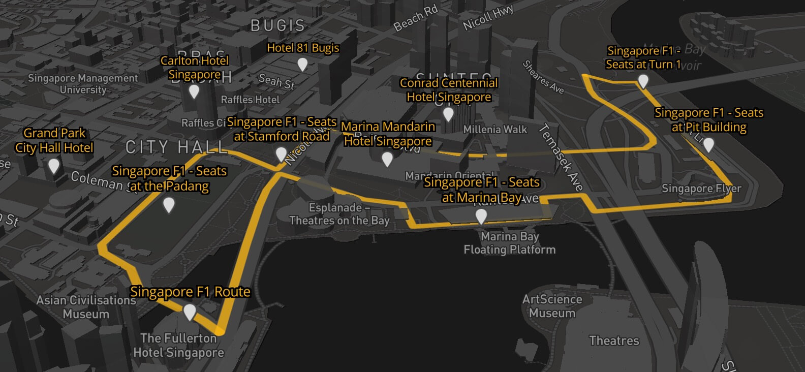

F1 Singapore
===

> A 2.5D map of the Singapore F1 Grand Prix circuit with landmarks around.

- Official web site: <http://www.singaporegp.sg/>
- Circuit park map: <http://www.singaporegp.sg/eventguide/circuit-park-map>
- Circuit information: <https://www.formula1.com/en/championship/races/2017/Singapore.html>
- Wikipedia: <https://en.wikipedia.org/wiki/Singapore_Grand_Prix>, <https://en.wikipedia.org/wiki/Marina_Bay_Street_Circuit>
- Data source: <https://www.google.com/maps/d/viewer?mid=1xls4CTDWXcN1gaUcVYgRsDXh7k8>
- KML-to-GeoJSON conversion: <https://mapbox.github.io/togeojson/>
- Map technology: <https://www.mapbox.com/mapbox-gl-js/>

Copyrights
---

All information are copyrighted by Singapore GP Pte. Ltd. The F1 FORMULA 1 logo, F1, FORMULA 1, FIA FORMULA ONE WORLD CHAMPIONSHIP, SINGAPORE GRAND PRIX and related marks are trade marks of Formula One Licensing BV, a Formula 1 company.